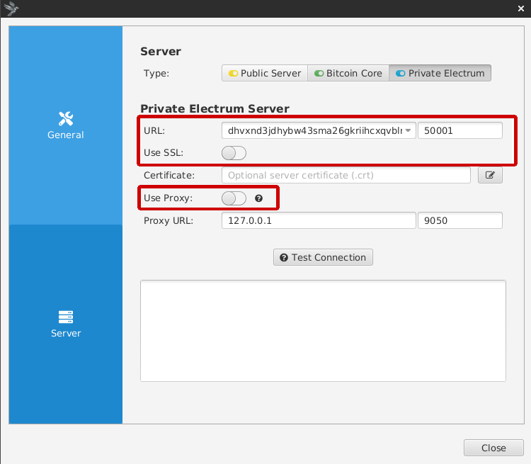
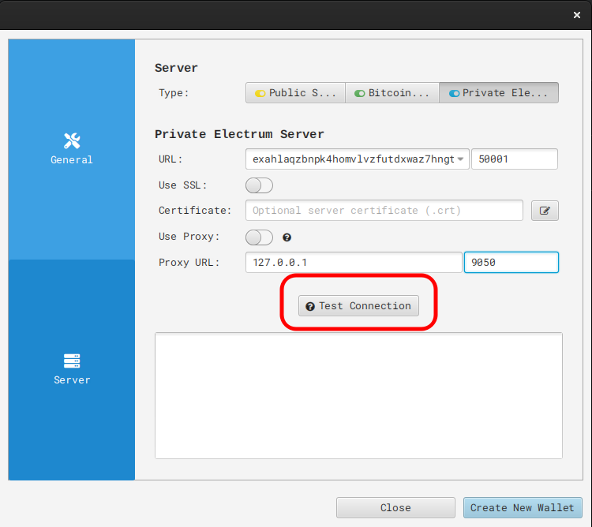
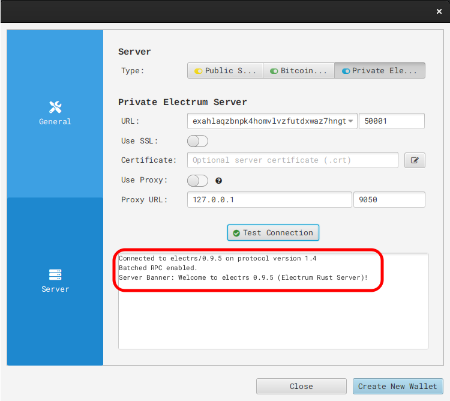

# Sparrow Integration Setup

1. Open Sparrow and go to "File -> Preferences -> Server," or if you are running for the first time, proceed through the introduction until the screen below.  Then select "Configure Server."

    

1. On the following screen, select "Private Electrum Server."

    
    
1. Enter your electrs Tor address (found in your Embassy's electrs service page, under "Interfaces"), removing the "http://" prefix.  Sparrow ships with a built in tor, which it will automatically use once you entered a .onion into the Electrum server URL text field, so ensure that "Use Proxy" is disabled.

    

1. Click "Test Connection."
    
    

1. You should see the success message below, then you may return to your wallet, or proceed to create a new one.

    